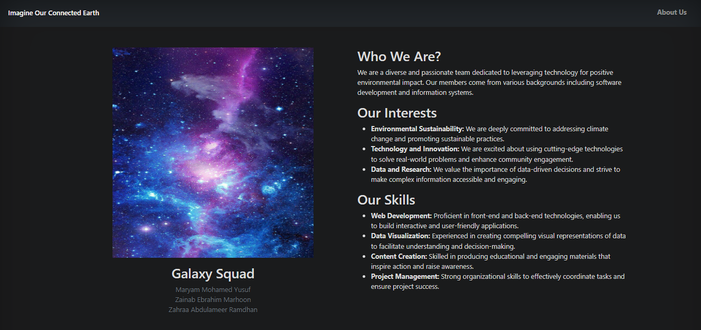
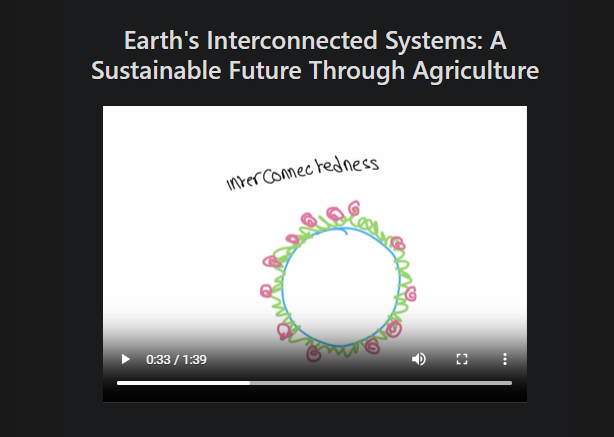

# Our Connected Earth

## Project Overview
"Our Connected Earth" is a web-based platform designed to educate users about the interconnectivity of Earth's systems. Through engaging visuals and informative content, we aim to highlight how various environmental factors, such as air quality, biodiversity, water resources, greenhouse gases, and sea level rise, are interconnected and impact one another. The site encourages users to understand the importance of sustainable practices and the role they play in maintaining the health of our planet.

## Features
- **Responsive Design**: Built with Bootstrap 5 for seamless viewing on all devices.
- **Interactive Carousel**: Showcases key Earth systems with images and descriptions.
- **Informative Video**: A planned feature to demonstrate the interconnections between Earth systems and strategies for improvement.
- **User-Friendly Navigation**: Clear links to the home page and the about us page for easy navigation.

## Technologies Used
- HTML5
- CSS3
- JavaScript
- Bootstrap 5
- NASA's Earth Data

## Screenshots





## Installation
To set up the project locally, follow these steps:
1. Clone the repository:
   ```bash
   git clone https://github.com/yourusername/our-connected-earth.git
